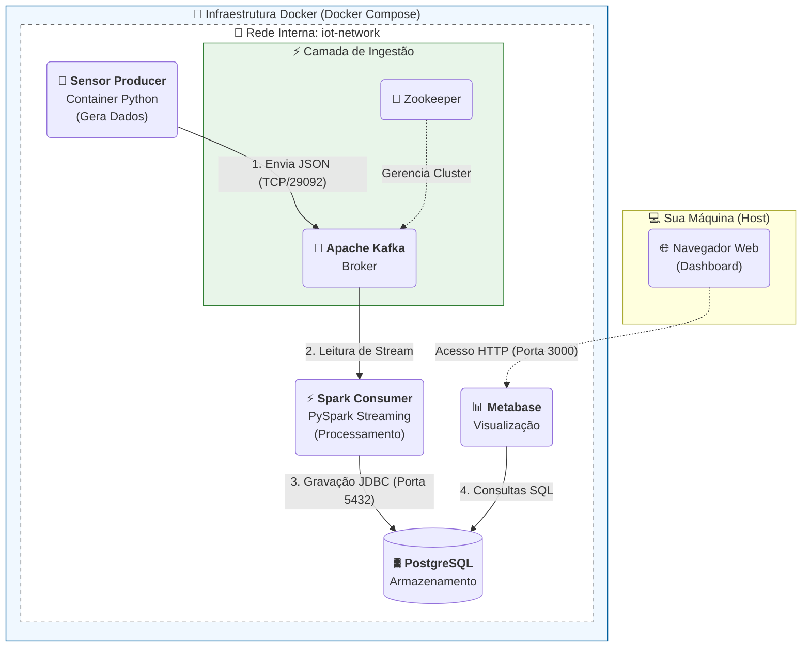

# IoT Sensor Streaming Pipeline

Solução de Engenharia de Dados para simulação, ingestão, processamento e visualização de dados de sensores IoT em tempo real. Este projeto simula um ambiente de Big Data escalável, resiliente e seguro, utilizando tecnologias de ponta conteinerizadas.

---

## Arquitetura da Solução

A arquitetura foi projetada seguindo o padrão de microsserviços e processamento de stream (Streaming ETL). O objetivo é garantir que os dados gerados pelos sensores sejam coletados, processados e disponibilizados para análise com latência mínima, garantindo integridade e tolerância a falhas.

### Diagrama de Fluxo de Dados



### Stack
Gerador de Dados (Producer): Script em Python 3.9 (biblioteca Faker) simulando dispositivos IoT com envio em alta frequência.

Ingestão (Message Broker): Apache Kafka + Zookeeper. Atua como buffer de resiliência, desacoplando produção e consumo.

Processamento (Consumer): Apache Spark (PySpark) operando em Structured Streaming. Aplica Schema Enforcement (tipagem forte) e regras de negócio.

Armazenamento (Serving Layer): PostgreSQL. Banco relacional para persistência transacional e integração com BI.

Visualização (BI): Metabase. Dashboard interativo para monitoramento em tempo real (atualização automática a cada 60s).

Infraestrutura: Docker & Docker Compose. Garante a orquestração e reprodutibilidade do ambiente.


#### Detalhes da Implementação

1. Segurança e Configuração
Variáveis de Ambiente: Nenhuma credencial (senhas de banco) está exposta no código fonte (hardcoded). Todas as configurações sensíveis são injetadas via os.getenv através do Docker Compose.

Automação (IaC): O banco de dados e o dashboard de BI são provisionados automaticamente via scripts SQL (init.sql e backup) mapeados nos volumes do Docker.

2. Ingestão e Produtor (src/producer)
Simulação Realista: Gera dados de Temperatura, Umidade e Status para cidades específicas (ex: São Paulo, Recife, Curitiba).

Performance: Otimizado para enviar múltiplos eventos por segundo, preenchendo os gráficos de série temporal sem "buracos".

3. Processamento (src/consumer)
Integridade de Dados: O Spark aplica um schema rígido (TimestampType, DoubleType). Dados fora do formato são tratados antes da persistência.

Persistência Eficiente: Utiliza a estratégia foreachBatch para gravações otimizadas via driver JDBC no PostgreSQL.

### Como Executar o Projeto
Pré-requisitos:  
[Docker e Docker Compose](https://www.docker.com/get-started/)
 instalados
#### Passo a Passo 
1. Clone o repositório utilizando o comando abaixo:  
git clone https://github.com/LucasAntves/case-iot-docker.git

2. Vá para a pasta do projeto que acabou de clonar e abra o terminal.

3. Com o terminal aberto na **raiz do projeto**, execute o seguinte comando:

```bash
docker compose up --build -d
```

4. Caso precise desligar os container e limpar tudo que foi gravado no postgres, use este comando
```bash
docker compose down -v
```

#### Acessando a tabela e o Dashboard:

Com nossos containers rodando e nossos dados sendo gerados, vamos usar nossa ferramenta de visualização:

Aguarde cerca de 1 minuto para a inicialização total do Metabase.

Acesse no navegador: http://localhost:3000

Login: admin@project.com

Senha: admin321

(Nota: O login acima é pré-configurado via script de automação).

**Monitoramento via Terminal**  
Você pode acompanhar o fluxo de dados em tempo real pelos logs:
Faremos pelo terminal na raiz do projeto.

***Ver envio de dados:***  
Antes de ver o log, precisamos checar como nossa producer está no docker, para isso execute:  
```bash
docker ps
```
O nome estará na coluna 'NAMES'. Assim que encontrar o nome da sua producer, rode o comando abaixo sem ( )

```bash
docker logs -f (NOME DA PRODUCER)
```

***Ver processamento Spark:***
```bash
 docker logs -f spark-consumer
```


***Escalabilidade da producer:***  
Esse comando servirá para escalar nossa producer, podemos gerar mais dados e checar como o kafka írá se comportar.

```bash
 docker compose up -d --scale sensor-producer=3
```

#### O que vai acontecer?
O Docker vai criar nome-producer-1  
O Docker vai criar nome-producer-2  
O Docker vai criar nome-producer-3

Caso tenha aumentado a produção de dados e queira checar, podemos visualizar no Kafdrop através do caminho:  
http://localhost:9000

Abra o tópico sensores-iot e cheque o size, atualize a página e teremos os números atualizados

#### Após o teste, podemos desligar algumas producers:  
```bash
docker stop NOME-PRODUCER
docker rm NOME-PRODUCER
```


### Testes e Validação
O projeto conta com uma suíte de testes automatizados (unittest).

#### Configuração do Ambiente Virtual (Python)

Para executar os scripts locais ou rodar os testes unitários, recomenda-se criar um ambiente virtual para isolar as dependências.

**1. Crie o ambiente virtual:**

Na raiz do projeto, execute:  
```bash
python -m venv venv
```

**2. Ative o ambiente:**

```bash
Windows (PowerShell):  
.\venv\Scripts\activate
```
Linux / Mac:
```bash
source venv/bin/activate
```

**3. Instale as dependências:**

pip install -r requirements.txt
(Após a instalação, o comando python -m unittest ... funcionará corretamente).

**Com seu ambiente virtual configurado, vamos aos testes:**
```bash
python -m unittest discover tests -v
```
Cobertura:  
Unitários: Validação de schema JSON, tipagem de dados e regras de negócio (limites de temperatura).

Integração: Validação da conexão com Kafka (envio e recebimento real de mensagens).

### Sobre o Dashboard (Analytics)
O painel do Metabase já vem pré-configurado e inclui:

* KPIs em Tempo Real: Temperatura e Umidade médias atuais.

* Monitoramento de Status: Tabela de cidades ordenada por criticidade (Vermelho/Crítico no topo).

* Séries Temporais: Gráfico de linhas comparativo mostrando a evolução da temperatura por cidade minuto a minuto.

* (O Dashboard possui Auto-Refresh configurado para atualizar a cada 60 segundos).

### Melhorias Futuras (Roadmap)
Pontos identificados para evolução da arquitetura em um cenário de escala massiva:

**Camada de Data Lake (Raw):** Implementar gravação paralela em Amazon S3 ou DynamoDB para armazenamento de dados brutos a longo prazo.  

**Orquestração:** Adicionar Apache Airflow para gerenciar jobs batch complementares, como a limpeza de dados antigos do banco relacional ou o retreinamento de modelos de Machine Learning baseados no histórico dos sensores.

**Observabilidade:** Implementar Prometheus e Grafana para monitorar a saúde dos containers (CPU/Memória) e o lag de consumo do Kafka.
